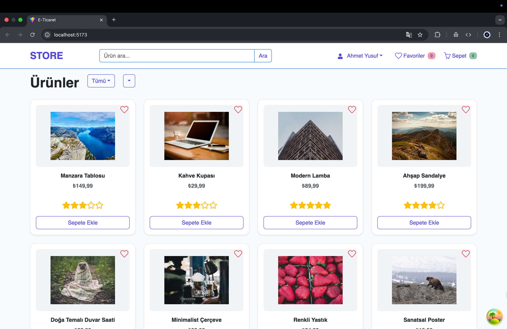

# 🛒 Fullstack E-Ticaret Uygulaması

Bu proje, modern frontend (React) ve backend (Node.js/Express.js) teknolojilerini kullanan tam özellikli bir **E-Ticaret Uygulamasıdır**. Kullanıcıların ürünleri görüntüleyip, sepetlerine ekleyebildiği, favorilere kaydedebildiği ve siparişlerini yönetebildiği bir online alışveriş platformudur.

---

## 🌟 Öne Çıkan Özellikler

✅ **Ürün Yönetimi**  
- Ürün listeleme ve detay sayfası  

✅ **Sepet ve Favoriler**  
- Ürünleri sepete ekleme ve kaldırma  
- Favorilere ekleme ve çıkarma  

✅ **Sipariş Yönetimi**  
- Sepeti onaylayarak sipariş oluşturma  
- Kullanıcı geçmiş siparişlerini görüntüleme  

✅ **Kayıtlı Adresler ve Kartlar**  
- Kullanıcı hesabında adres ve kart yönetimi (ekleme, silme, güncelleme)  
- Ödeme esnasında kayıtlı kart/adresleri seçebilme  

✅ **Yorum ve Değerlendirme**  
- Ürünlere yorum yapabilme  
- Kullanıcı değerlendirmeleri  

✅ **Kullanıcı Yönetimi**  
- Kayıt ve giriş işlemleri  
- JWT tabanlı kimlik doğrulama  
- Rol bazlı erişim kontrolü (Admin, Kullanıcı)

---

## 🏗️ Proje Yapısı
---

## ⚙️ Teknolojiler

### Frontend
- **React** – Kullanıcı arayüzü
- **Redux Toolkit** – Global state yönetimi
- **React Query** – Veri yönetimi ve caching
- **Formik & Yup** – Form yönetimi ve doğrulama
- **Axios** – API istekleri
- **Bootstrap & React Bootstrap** – Responsive UI
- **SweetAlert2, React Hot Toast** – Bildirimler ve uyarılar

### Backend
- **Node.js & Express** – REST API
- **MongoDB & Mongoose** – Veritabanı
- **JWT & bcrypt** – Kimlik doğrulama ve şifreleme
- **dotenv** – Ortam değişkenleri yönetimi
- **CORS** – Güvenli API erişimi

---

## 🚀 Kurulum ve Çalıştırma

# Backend kurulumu ve çalıştırma
cd server
npm install             # Gerekli paketleri yükler
npm run dev             # Geliştirme ortamında backend'i başlatır

# .env dosyası içeriği (server/.env):
PORT=5000               # API'nin dinleyeceği port
MONGO_URI=<MongoDB bağlantı string>  # Veritabanı bağlantı adresi
JWT_SECRET=<gizli anahtar>           # JWT kimlik doğrulama için gizli anahtar

# Frontend kurulumu ve çalıştırma
cd client
npm install             # Gerekli frontend paketlerini yükler
npm run dev             # Frontend'i başlatır
